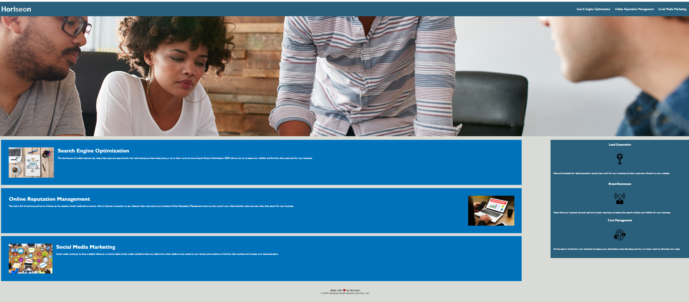

#Alyssa Pidgeon's Portfolio Page

##Description
This webpage is a portfolio page to showcase my work for future employees. Placeholder images have been used and will be replaced as I continue to produce more work. 

To create this webpage, I have added navigation links to each main section of content in the webpage to allow the user to be directed to the specific link. 
The webpage has also had media query applications to allow display changes when viewing on a mobile. 

Usage
The following link will direct you to the deployed web application:

Link to the webpage: https://alyssapidgeon.github.io/Week-one-challenge-Horiseon/#social-media-marketing

This is an image of the web application's appearance:

Image: 

License
MIT License